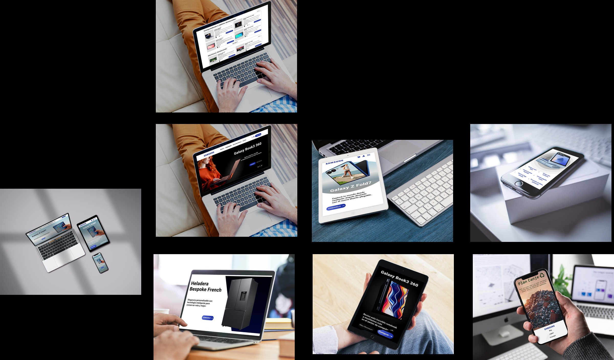
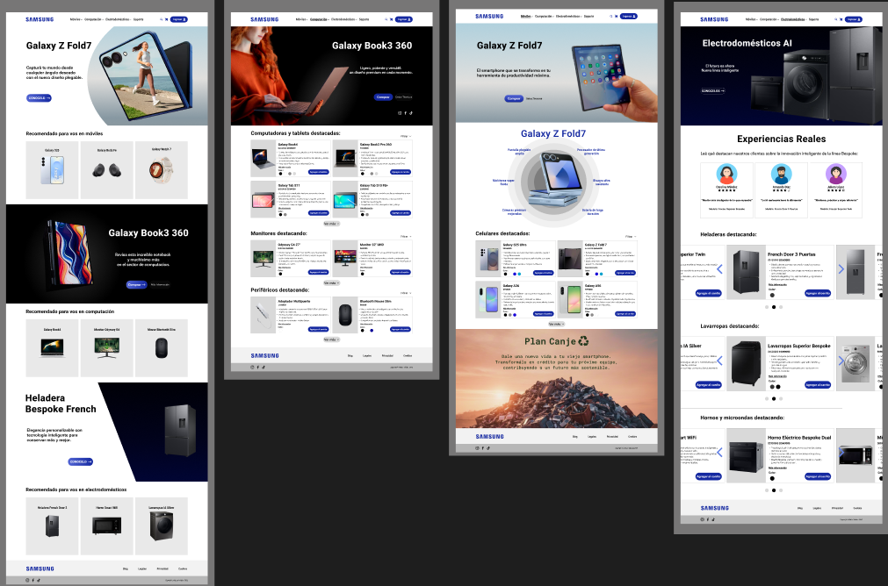
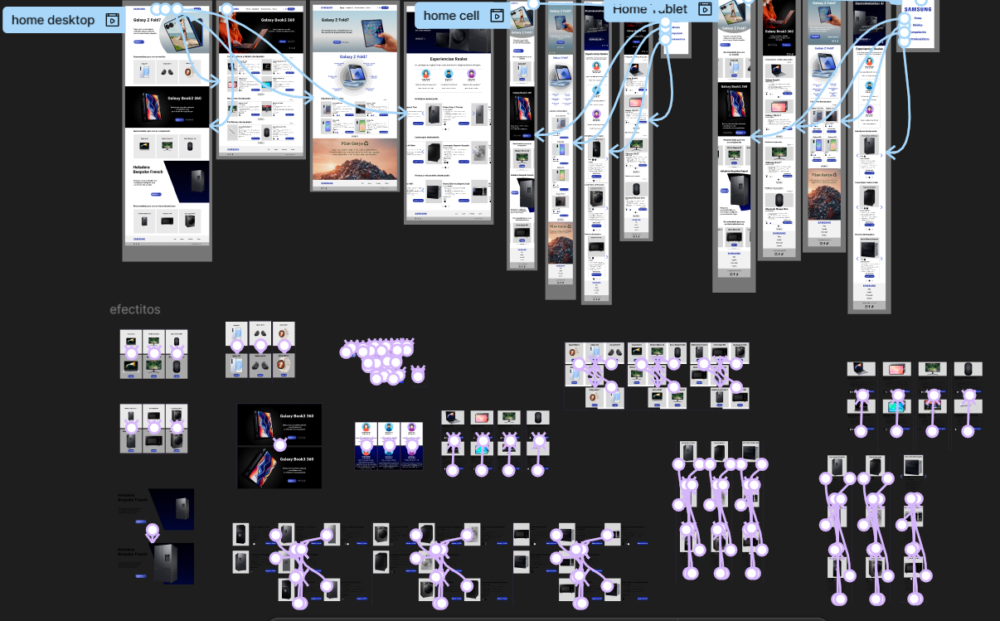
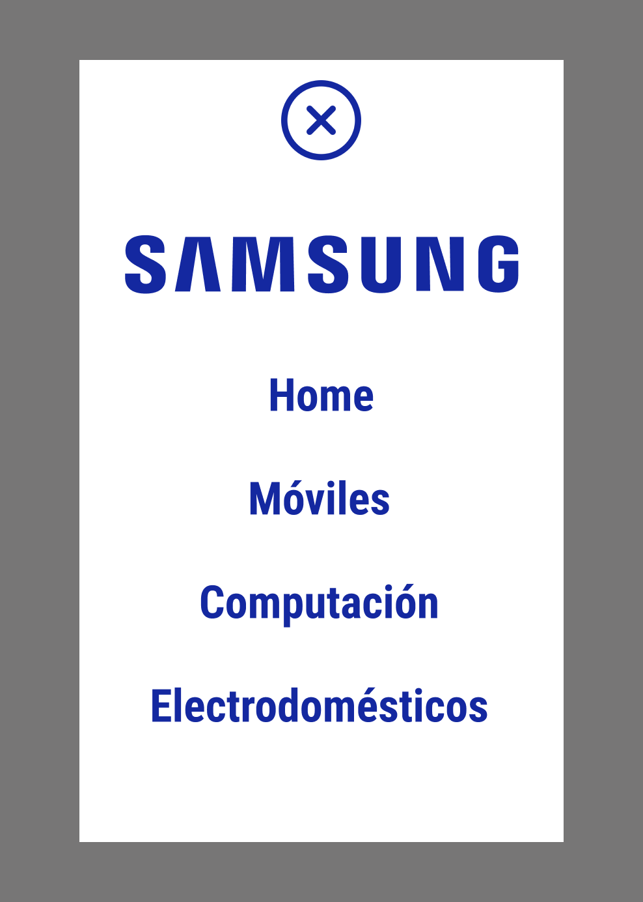
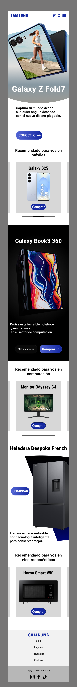
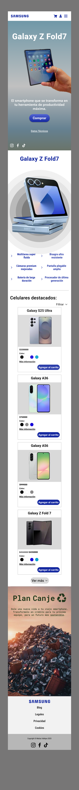
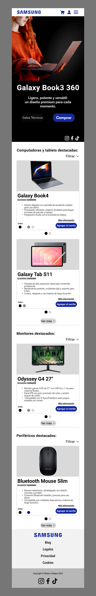

# Samsung E-Commerce — UI/UX Design & Mockups

Proyecto de diseño de interfaces y prototipado interactivo desarrollado en **Figma** para la materia **Comunicación Visual**. El objetivo fue concebir una experiencia de comercio electrónico integral tomando como referencia la identidad visual, tipográfica y de marca de **Samsung**.

---
## 🔗 Prototipo Interactivo

Podés navegar el diseño completo y probar las transiciones entre pantallas:

* 🖥️ **[Prototipo — Desktop](https://www.figma.com/proto/omKtMznmTsf7DRMGa87Of6/Matias-Vallejos-Final-Comunicacion-Visual?node-id=10-3&starting-point-node-id=10%3A3)**
* 📱 **[Prototipo — Mobile](https://www.figma.com/proto/omKtMznmTsf7DRMGa87Of6/Matias-Vallejos-Final-Comunicacion-Visual?node-id=184-2554&starting-point-node-id=184%3A2554)**
* 📲 **[Prototipo — Tablet](https://www.figma.com/proto/omKtMznmTsf7DRMGa87Of6/Matias-Vallejos-Final-Comunicacion-Visual?node-id=256-636&starting-point-node-id=256%3A636)**
* 🎨 **[Ver el archivo completo en Figma](https://www.figma.com/design/omKtMznmTsf7DRMGa87Of6/Matias-Vallejos-Final-Comunicacion-Visual)** — componentes, variantes y mesa de trabajo.

## 📱 Mockups y Presentación en Dispositivos

---

## 🌟 Aspectos destacados del proyecto

* **Diseño Responsive Integral:** Adaptación y jerarquía visual pensada para Desktop, Tablet y Mobile.
* **Secciones diseñadas:**
  * Home principal con productos destacados y banners promocionales.
  * Catálogo de Computación & Tablets (filtros, tarjetas con especificaciones y selección de color).
  * Catálogo de Dispositivos Móviles y Plan Canje.
  * Electrodomésticos AI y testimonios de usuarios.
* **Prototipado Interactivo:** Flujos de navegación y transiciones entre pantallas, incluyendo menú desplegable modal.

---

## 🖥️ Versión Desktop (Web)

---

## 🔀 Flujo de Navegación y Prototipado

Visualización de las interacciones, transiciones entre vistas y estados de componentes modelados en Figma:

**Menú desplegable modal**, uno de los componentes interactivos del prototipo:

  

---

## 📲 Vistas Mobile y Tablet

Capturas del recorrido completo de cada resolución. Están plegadas para no cortar la lectura — hacé clic en cada una para desplegarla:

📱 <b>Mobile — Home</b>

📱 <b>Mobile — Catálogo de Celulares</b>

📲 <b>Tablet — Vista completa</b>

---

## 🛠️ Herramientas utilizadas

* **Figma:** Diseño de componentes, variantes, auto layout, maquetación y prototipado interactivo.
* **Identidad de marca:** Paleta corporativa (Samsung Blue), tipografía y recursos visuales oficiales.

---

> ⚠️ **Aviso legal:** Este proyecto fue realizado con fines exclusivamente académicos para la carrera de Analista de Sistemas / Comunicación Visual y no posee afiliación comercial u oficial con Samsung Electronics.
